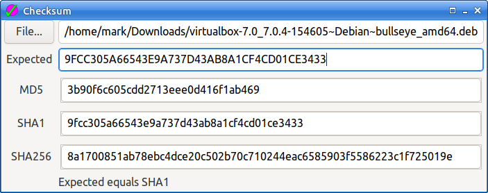

# Checksum

Checksum is a simple GUI application for finding the MD5, SHA1, and SHA256
hashes of a specified file. The initial file can be given on the command
line, but normally is chosen by clicking the File button. If an expected
hash is entered in the Expected line entry, it will be compared with the
generated hashes and a match reported.

I created this as my first Go/Gtk application to learn how to use the
library.

## License

Apache-2.0

---
